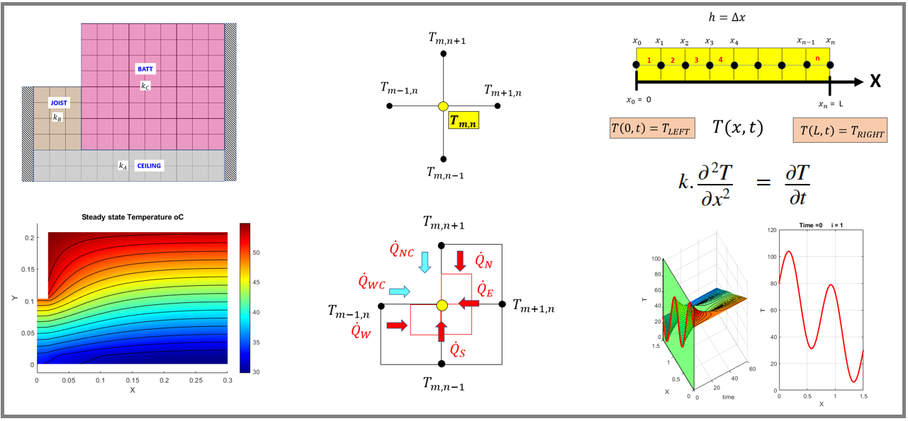
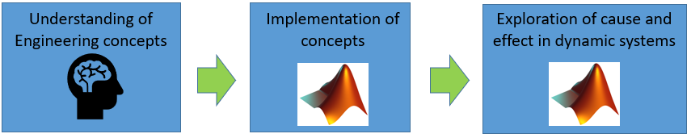
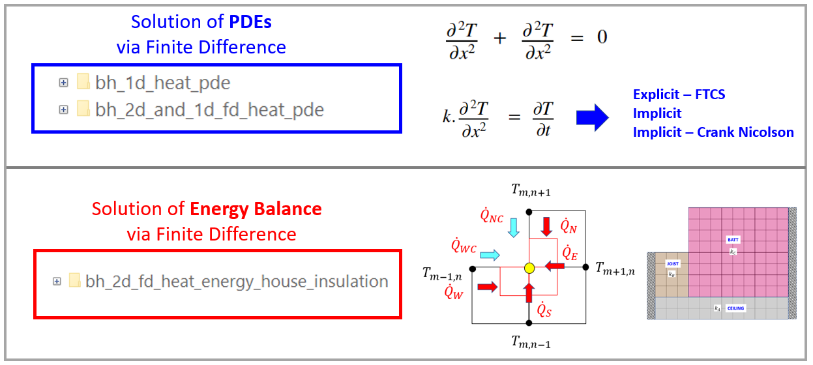

# Heat Transfer Analysis - PDEs and Energy Balance

In this demo packet we perform a thermal analysis on a collection of **1-D transient** and **2D Steady State**, case studies.  In all case studies a **Finite Difference (FD)** derivation is performed (eg: stencils are derived).  The Finite Difference formulation is then solved and **validated** by either MATLAB's built in PDE solver OR by the Partial Differential Equation Toolbox.  Please see the "*Concepts and Learning Benefits*" section for a summary on the learning benefits demonstrated by these examples. Topics covered in the examples include:

**1-D Transient Heat Conduction:    Solving the 1-D PDE heat equation**

   -  an explicit FD technique - Forward Time Central Space (FTCS)  
   -  an implicit FD technique - standard 
   -  an implicit FD technique - Crank Nicolson 

**2-D Steady State heat Conduction:    Solving the 2-D PDE Laplace equation**

   -  a standard explicit FD technique for solving Laplace's equation on a simple square sheet 

**2-D Steady State heat Conduction:    An Energy Balance approach**

   -  An "authentic" house insulation design case study supporting 2-D conduction and convection 

  
## Owner

   -  Bradley Horton (bhorton@mathworks.com) 

  
## Concepts and Learning Benefits

   1.  **Symbolic computing** can support and enhance the 1st principles  derivation of the Finite Difference node stencil equations. 
   1.  **Live Scripts** and Functions allow the student to **create a Design review document,** eg: Diagrams and derivations are beside their Computational implementations.   
   1.  **MATLAB** allows the student to effeciently **implement their Finite Difference algorithms**  - as a scientific language, MATLAB allows the focus to be on technical computing rather than "pure" software development 
   1.  **Old concepts done in NEW ways** - Using textural indexing in Tables to assemble the Finite Difference system equations 
   1.  MATLAB solves the  system of equations and allows the computed node temperatures to be **visualized** - giving insights into dynamics of the heat transfer 
   1.  **Brain derived** Finite Difference solutions can be quickly(and easily) **validated** against the solutions produced by MATLAB's pde solver AND the solver of the **PDE toolbox**. 

The following infographic summarises the intentions of this demo:

## Suggested Audience

The content was designed for 2 different audiences:

A **Numerical methods** class:  

   -  Typically a 2nd year undergraduate class(Engineering or Science).   
   -  The examples focused on the **numerical solution of PDEs**, are aimed at THIS audience. 

A **Heat transfer** class:

   -  Typically a 3rd-4th year undergraduate class(eg:  Mechanical Engineering).   
   -  The example focused on the **Heat transfer Energy Balance**, are aimed at THIS audience. 

## Workflow

   1.  Navigate into one of the example folders (eg: **`bh_2d_and_1d_fd_heat_pde`** ) 
   1.  Open and read the file **`DEMO_START_HERE_PLEASE.mlx`** - this is a Live script, which introduces the examples contained within that folder.  The **`DEMO_START_HERE_PLEASE.mlx`** script gives instructions on how to open each DEMO file. 

  
## Release that demo was last tested in

R2021a to R2022b

  
# ToDo

*Create a simpler version of the House insulation case study, eg: start with a course mesh already defined in a node definition EXCEL file.*

  
## System Requirements

These demos have been developed and tested in the R2021a to R2022b MATLAB releases.

The Demo has the following product dependencies:

   1.  MATLAB 
   1.  Symbolic Math Toolbox 
   1.  Partial Differential Equation Toolbox 

## Revision History

First draft 25-Jul-2021

